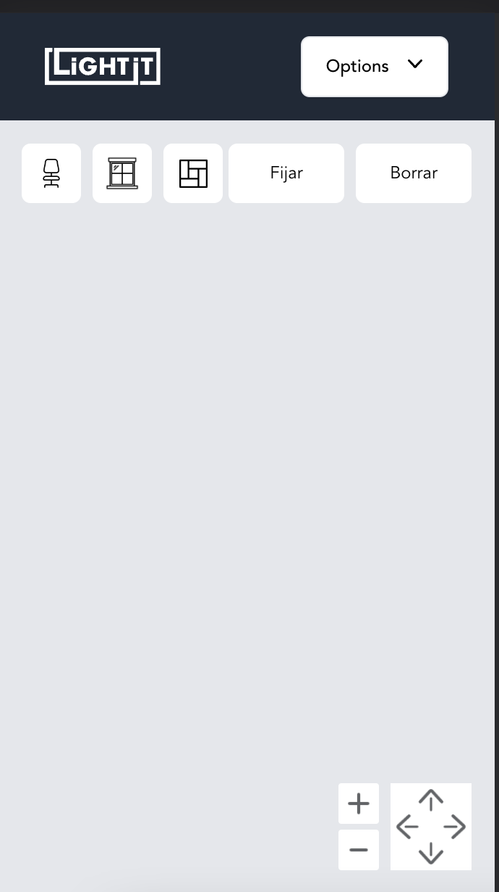
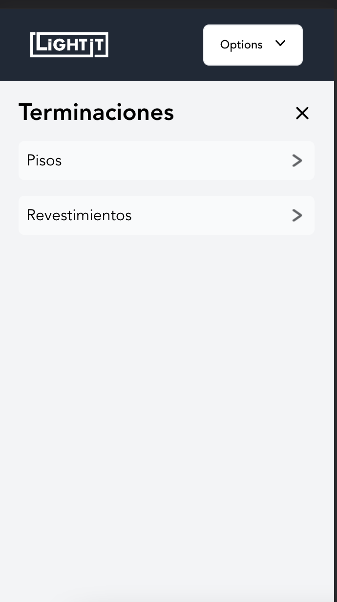
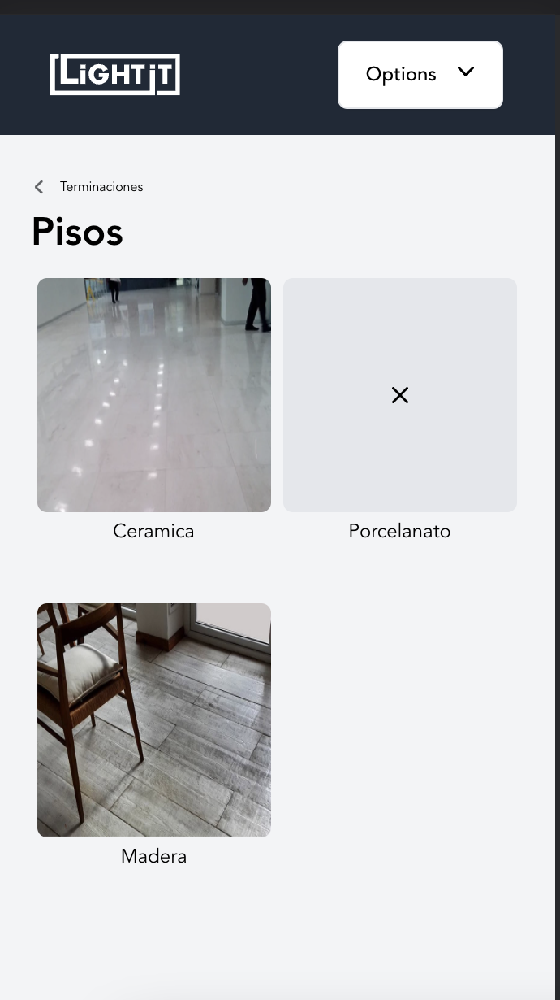

# Lightit Challenge

## Demo link:

[lightit-challenge.vercel.app/](https://lightit-challenge.vercel.app/)

## Table of Content:

- [Considerations](#considerations)
- [Screenshots](#screenshots)
- [Technologies](#technologies)
- [Setup](#setup)
- [License](#license)

## Considerations

This application was built to be responsive, using 425px, 640px and 1024px view widths.

Changed the structure of the data provided. Included name and ids.

```js
// example of "aberturas":
{
  name: "Aberturas",
  items: [{ id: "puertas", name: "Puertas", items: [...] }]
}
```

Using msw, I added a mocked server to run with the application so we can play around with the api calls during development. Server is still active in production.

## Screenshots

### Desktop


### Mobile





## Technologies

For this project I have used:

- [React](https://es.reactjs.org/)
- [Vitejs](https://vitejs.dev/)
- [Tailwind](https://tailwindcss.com/)
- [MSW](https://mswjs.io/docs/)
- [React Testing Library](https://testing-library.com/docs/react-testing-library/intro/)

## License

MIT license
